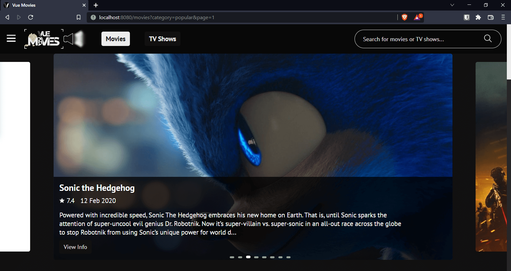
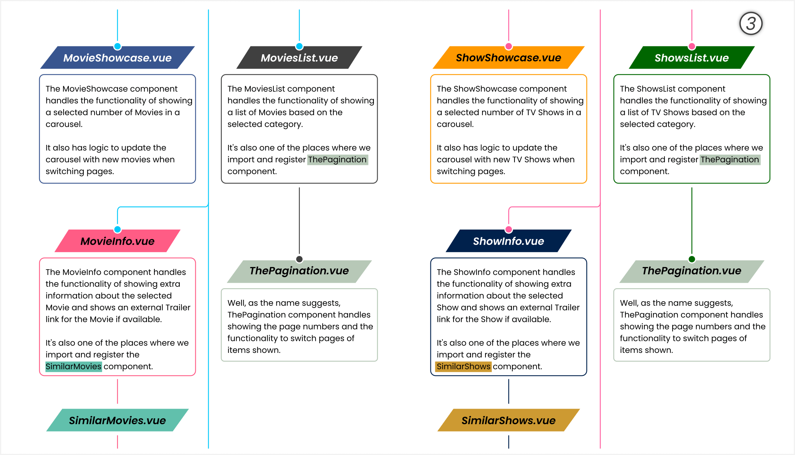

# Vue Movies

This is a challenge I designed to help me practice my skills with the [Vue.js](https://v3.vuejs.org) framework.

## Table of contents 📖

- [Overview](#overview-)
  - [About the challenge](#about-the-challenge-)
  - [Screenshots](#screenshots-)
  - [Links](#links-)
  - [Quickstart guide](#quickstart-guide-)
- [My process](#my-process-gear)
  - [Built with](#built-with-hammer_and_wrench-pencil-triangular_ruler)
  - [What I learned](#what-i-learned-)
  - [Continued development](#continued-development-stopwatch)
  - [Useful resources](#useful-resources-)
- [Author](#author-)

## Overview 🔎

---

### About the challenge ❔

The challenge aims to test the developer's skill in:

- Creating and registering components
- Handling component communication
- Use of Vue's Lifecycle Hooks
- Setting up routing with Vue Router

<br/>

### Screenshots 📷

---


Screenshot of the **included** design file.

- It's shows a general view of the page designs.

---

<br/>


Screenshot of the **included** design file.

- It's shows a closer look at one of the design pages and the process I use to figure out things like the **positioning** and **spacing** of elements. You can learn more about that here: [Designing and Coding Layouts](https://github.com/AllanKirui/designing-and-coding-layouts)

---

<br/>



Screenshot of the **Homepage** running on my **Local Development Server**.

- When you first visit the site, you get directed to the Homepage which holds content for Movies.
- At the very top, there's the nav which contains:
  - a burger to open the menu.
  - navigation links to switch between the different sides of the site. The Movies side being the default side.
  - a mini search bar which can be used to search for Movies/TV Shows depending on the active side of the site. It returns a limited number of search results, providing the option to view more results.
- Below the nav, you can see a showcase of Movies comprised of a select number of Movies and below it is a list of Movies.
- By default, the category shown is the popular category.

---

<br/>


Screenshot of the **Homepage** scrolled down.

- It shows the list of Movies that is below the showcase.

---

<br/>


Screenshot of the **Hover Popup** on a Movie item.

- Hovering on a Movie shows a popup containing additional information about the Movie.
- The overview of a Movie gets trimmed if it's too long and the position of the popup is calculated whenever the page is resized so that it doesn't overflow to the right of the screen.

---

<br/>


#### Screenshot of the **Movie Info** component.

- Clicking on a Movie takes you to a page containing more information about the Movie.
- Note that the URL also gets updated to reflect the changes.
- In this page, you can view the full overview and other important details such as genres and country of production.

---

<br/>


Screenshot of the **Movie Info** page scrolled down.

- Scrolling down, you'll find a trailer card. I decided not to build a video player for this part, so what I did is that I set the backdrop poster of the Movie being shown as the background for the trailer card.
- Hovering on the trailer card shows a play icon which links to the trailer for the Movie on YouTube.

---

<br/>


Screenshot of the **Movie Info** page scrolled further down.

- Scrolling further down, below the trailer card, you get suggestions for Similar Movies based on the Movie whose details are shown above.

---

<br/>


Screenshot of the **Nav Search Bar** in action.

- It shows a limited number of search results, but if there are more results for the search term provided, you get access to the _View More Results_ button.

---

<br/>


Screenshot of the **Expanded Search Results**.

- Clicking on the _View More Results_ button will open up a new page with more results for the search term you had provided on the Nav Search Bar.

---

<br/>


Screenshot of the **TV Shows** side of the site.

- Clicking on the TV Shows link in the nav will load TV Shows.
- As with the Movies side, you get showcased items and a TV Shows list.

---

<br/>


Screenshot of the **Pagination**.

- It shows the page buttons used to navigate between the various pages of loaded Movies, TV Shows, and search results.

---

<br/>


Gif of the **Burger Menu**.

- The menu has options to switch between Movies and TV Shows, as well as options to switch between the Popular and Top Rated categories.

---

<br/>


Gif of the **Placeholders**.

- The gif above shows the content placeholders for the showcase and list items.

---

<br/>


Screenshots of the **Error** pages.

- They show how the Not Found and the Net Error pages look on mobile devices.

---

<br/>





Screenshots of the **App Tree**.

- They show an overview of the components, how they relate to each other and also describes some of the attached functionality.

  _I'm sorry if I partially blinded you there. I'll be sure to add dark themed images on my next project._ 😉

<br/>

### Links 🔗

- Live Site URL: [Vue Movies](https://allankirui.github.io/vue-movies/)

<br/>

### Quickstart guide 📜

To run the code, you need to follow these steps:

1. Clone or download the repository to your computer.
2. You might need to install [Node.js](https://nodejs.org/) for the following steps.
3. Open a terminal window and navigate to the directory containing the repository.
4. Run `npm install` in the terminal to install required dependencies (This will create a **node_modules** folder.)
5. Run `npm run serve` to bring up the development server. You can view the app at **localhost:8080**
   (or whichever port is shown in your terminal).

<br/>

## My process :gear:

---

It all started with the API. I went through the documentation for the [TMDB API](https://themoviedb.org/documentation/api) and learned how I could make requests for the poster and backdrop images, hence how I got the images for the designs.

With the images downloaded, I begun the design process and after some trial and error, I chose a suitable layout for the various parts of the app such as the showcase, search results, similar movies etc. I then proceeded to add more details to the designs such as colors, typography etc.

Having captured all my ideas about the app in the design, I initialized the Vue app and started meeting the design requirements one line of code at a time. 🏁

<br/>

### Built with :hammer_and_wrench: :pencil: :triangular_ruler:

- HTML5
- CSS Flexbox
- CSS Grid
- [Vue](https://v3.vuejs.org) - The Progressive JavaScript Framework
- [TMDB API](https://themoviedb.org/documentation/api) - The Movie DB API
- [Inkscape](https://inkscape.org) - Inkscape: Open Source Scalable Vector Graphics Editor

<br/>

### What I learned 🎓

The time I spent working on the project was a great way for me to practice my Vue skills - A great way for me to work with Vue's _reactivity_ and to get better at:

- **component communication** 📡
  - This involves sending data from a _parent component_ to a _child component_ using a special Vue feature known as [props](https://v3.vuejs.org/guide/component-props.html#prop-types).
  - The communication also works in the opposite her direction i.e from a _child component_ to a _parent component_ using the built in [custom events](https://v3.vuejs.org/guide/component-custom-events.html#event-names) feature.
  - And if you want a sort of _long range_ communication between an _ancestor_ and a _descendant_, you have [provide and inject](https://v3.vuejs.org/guide/component-provide-inject.html#working-with-reactivity). Another Vue provided feature.

<br/>

- **using lifecycle hooks/methods** 🔁
  - Knowing when to use which lifecycle hook has made me understand more about how Vue works behind the scenes. I've also been able to achieve some functionality that I don't think would have been possible otherwise. 😅

<br/>

- **setting up routing with Vue Router** ↩️
  - This involves creating various routes for the different components of the app.

<br/>

**Here's some of the code that I'm proud of** 😎

Using [Vue's lifecycle methods](https://v3.vuejs.org/guide/composition-api-lifecycle-hooks.html) i.e., the `beforeUpdate()` and `Updated()` lifecycle hooks was very instrumental in creating the **Hover Popup** that appears when hovering over a Movie/TV Show item.

The `checkWindowSize()` method listens to the `resize` event on the `Window` and calls the `setInfoCardPosition()` method that does most of the heavy lifting.

In short, the `setInfoCardPosition()` method checks if showing the **Hover Popup** will make it overflow to the right of the viewport, and adjusts the position accordingly.

```javascript
beforeUpdate() {
  // call these methods before the page is updated
  this.setInfoCardPosition();
  this.checkWindowSize();
},
updated() {
  // call these methods when the page is updated
  this.setInfoCardPosition();
  this.checkWindowSize();
},
```

Here's a gif showing how it works.


---

As for showing the [trailer card](#screenshot-of-the-movie-info-component), I use the `setTrailerLink()` method which takes in a list of video links and returns a list of valid links. The list of links passed to the method is from the data received after making a `fetch` request for videos.

Inside the `setTrailerLink()` method, I check if the links received have a valid trailer _type_ and if the _source_ of the trailer is YouTube.

```javascript
setTrailerLink(videoLinks) {
  const links = [];
  // loop through the available links
  for (const link of videoLinks) {
    // check if the video is of type Trailer or Clip
    if (
      link.type.toLowerCase() === "trailer" ||
      link.type.toLowerCase() === "clip"
    ) {
      // split the name property
      const nameArray = link.name.toLowerCase().split(" ");
      // check if it contains the string Official or Final or Trailer
      if (
        nameArray.indexOf("official") !== -1 ||
        nameArray.indexOf("final") !== -1 ||
        nameArray.indexOf("trailer") !== -1
      ) {
        // check if the trailer source is YouTube
        if (link.site.toLowerCase() !== "youtube") return;
        // add the link to the links array
        links.push(link);
      }
    }
  }
  return links;
},
```

---

While I was finishing up the project, I thought it would be a great idea if I stored the app's states to the browser's local storage.

The reason behind this was mainly to enhance the user experience i.e., if a user last visited the TV Shows side of the site, then revisited the site later, they would be directed to the _last active side_ they were on. Not only would they get redirected to the _last active side_, but also to the category they last viewed.

Here's a snippet of the code from `main.js`, where I've set the app's routing configuration. I retrieve the stored app states from local storage and set the path to load if the user enters something like _/vue-movies/_ in the URL with nothing after the backslash.

```javascript
const setRedirectPath = () => {
  // get stored app states from local storage
  const retrievedState = JSON.parse(localStorage.getItem("appState"));
  // if there's no stored app states, return movies as the path to use
  if (!retrievedState) return "movies";
  // otherwise use the stored app states
  const retrievedPath = retrievedState.lastActiveSide;
  return retrievedPath ? retrievedPath : "movies";
};

// create the router
const router = createRouter({
  history: createWebHistory(),
  routes: [
    { path: "/", redirect: setRedirectPath },
    // ...
  ],
});
```

---

The `App.vue` component is where I store the app's states to local storage once the component has been updated with data from the active components.

```javascript
updated() {
  // save app states to local storage
    const appState = {
      lastActiveSide: this.selectedSide,
      lastActiveCategory: this.category,
    };
    localStorage.setItem("appState", JSON.stringify(appState));
  },
```

I also retrieve the stored app states in the `beforeMount()` hook of the various components that need it.

---

<br/>

### Continued development :stopwatch:

Going forward, I want continue learning more about frontend development and to practice what I already know by tackling more projects built with **Vue**. Applying the features and best practices that I've learnt from working on this project.

<br>

### Useful resources 💎

- [Inkscape](https://inkscape.org) - Inkscape SVG Editor. I use it all the time when I'm working on any web project. After designing the project, I used Inkscape's in-built tools to help me figure out the _spacing_, _sizing_ and _positioning_ of elements throughout the project. To better understand how I approached coding the project using Inkscape, have a look at this repository I made - [Designing and Coding Layouts](https://github.com/AllanKirui/designing-and-coding-layouts)

- [Vue Presentation](https://allankirui.github.io/A-Vuejs-Presentation/) - A while back after I had started learning **Vue**, I made a presentation on the framework. Do take a look, it might give you a better understanding of what the framework is about.

- [Vue3 Carousel](https://ismail9k.github.io/vue3-carousel/) - Vue.js 3 carousel component.

- [unDraw](https://undraw.co/) - Open-source illustrations for any idea you can imagine and create.

- [Medium](https://huishun.medium.com/how-to-deploy-a-vue-js-application-with-dynamic-routing-on-github-pages-3d36f4644e54) - How to Deploy a Vue.js Application with Dynamic Routing on GitHub Pages by **Hui Shun Chua**

<br>

---

## Author ✍🏾

- Github - [Allan Kirui](https://www.github.com/AllanKirui)
- Instagram - [@nallawilljr](https://www.instagram.com/nallawilljr)
- Email - <allan.kirui@outlook.com>

Thank you for taking your time to go through this readme and I hope you'll remember to use [Vue Movies](#links-) the next time you're browsing for Movies or TV Shows. 😉

If you do encounter any _undocumented features_ a.k.a bugs, kindly let me know.

## ✌️

[Back to top](#vue-movies)
